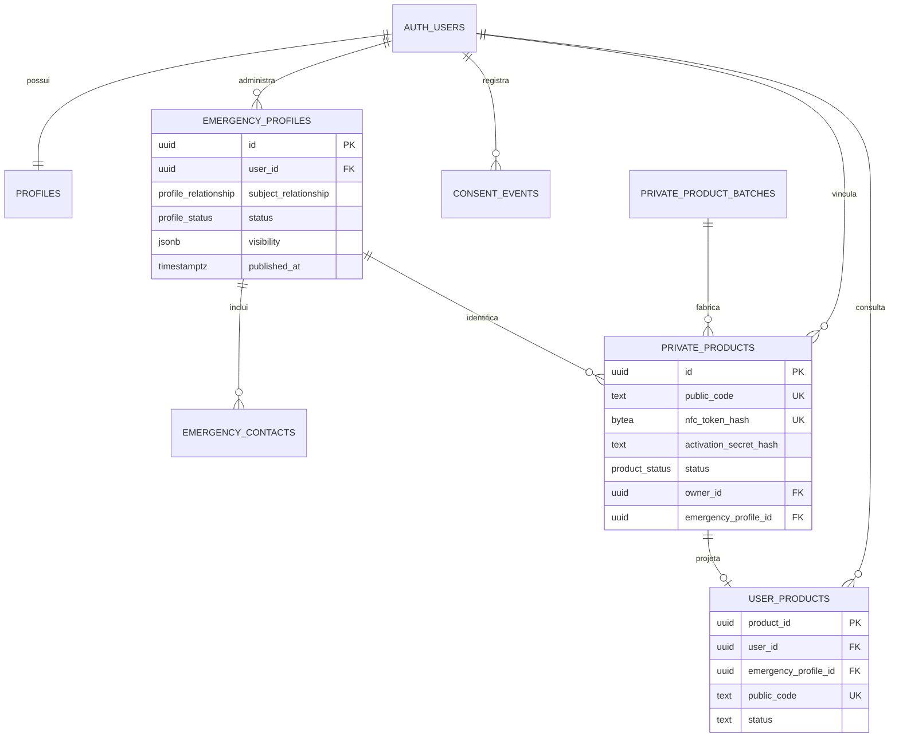

# Resolveu SOS — fundação técnica e auditoria da etapa 1

Data da revisão: 21 de agosto de 2026.

## Escopo e decisões

- Supabase é a única fonte de verdade para Auth, PostgreSQL, Storage e Edge Functions.
- Cloudflare/Sites serve a aplicação; D1 e R2 permanecem desativados.
- O schema `public` contém somente a superfície autenticada com RLS. Segredos, produtos de fabricação, administração e segurança ficam em `private`, fora da Data API.
- A consulta de emergência nunca lê tabelas médicas diretamente. Uma Edge Function chama uma projeção SQL fechada e devolve um DTO explícito.
- A preferência visual atual da responsável pelo produto é fundo claro; ela substitui a indicação antiga de fundo azul-marinho sem alterar os requisitos de contraste e acessibilidade.
- A conta é exclusiva para pessoas adultas, mas pode administrar perfis próprios, de filhos menores e de dependentes. A data de nascimento permanece privada; somente idade ou faixa derivada pode ser publicada.
- A Fase 2 implementou múltiplos perfis: a responsável não é sinônimo da pessoa descrita, e cada produto aponta explicitamente para um perfil.

## Resultado da auditoria

### Corrigido nesta etapa

- Removido o índice `unique(owner_id, id)`, que não impedia vínculo indevido e não expressava uma regra útil.
- `user_products` passou de view inviável sobre o schema privado para tabela de projeção autenticada, somente leitura para a titular e protegida por RLS.
- A ativação agora cria a projeção `user_products` na mesma transação que vincula o produto.
- Adicionadas verificações para formato do mapa de visibilidade, coerência entre publicação e `published_at`, tamanho do hash NFC e coerência entre estado, titular e ativação.
- Adicionados índices ausentes em chaves estrangeiras e filtros frequentes.
- A chamada a `crypt` foi qualificada como `extensions.crypt` dentro da função com `search_path` vazio.
- Confirmado TypeScript estrito, versões fixadas e lockfile presente.
- Confirmado que `.env*` é ignorado pelo Git e que apenas chaves publicáveis usam o prefixo `NEXT_PUBLIC_`.

### Pendências deliberadas para as próximas etapas

- As migrations foram aplicadas e verificadas no projeto de desenvolvimento `sos` durante a etapa 2. Consulte [`stage-2-database-rls-report.md`](stage-2-database-rls-report.md).
- O contrato final de `server_get_emergency_profile` será implementado após os testes RLS da etapa 2.
- A validação de data futura e maioridade deve ocorrer no cliente e novamente no servidor; não usa `current_date` em `CHECK`, pois constraints devem ser determinísticas.
- Estados administrativos, trilha de auditoria, documentos legais e rate limit serão criados nas etapas correspondentes.
- O `CAPTCHA_SECRET` local continua como placeholder. O segredo real deve existir no Supabase, nunca no frontend.

## Diagrama de dados

## Máquinas de estado

### Perfil de emergência

| Estado | Entrada permitida | Saída permitida | Visível publicamente |
|---|---|---|---|
| `draft` | criação ou edição inicial | `published` | não |
| `published` | prévia confirmada + consentimento vigente | `hidden` | sim, somente campos autorizados |
| `hidden` | ocultação imediata ou bloqueio | `published` após nova confirmação | não |

Publicar exige `published_at`, consentimento de dados sensíveis, autorização separada de publicação e produto ativo. Salvar dados nunca publica automaticamente.

### Produto

| Estado | Transições permitidas | Regra |
|---|---|---|
| `available` | `active`, `revoked` | sem titular e sem data de ativação |
| `active` | `blocked`, `revoked` | titular e data de ativação obrigatórias |
| `blocked` | `active`, `revoked` | consulta pública indisponível |
| `revoked` | terminal; substituição cria nova credencial | token anterior nunca volta a ser válido |

Transferência não troca silenciosamente `owner_id`: revoga a credencial anterior e usa fluxo administrativo explícito.

## Contrato de visibilidade pública

Todos os campos começam privados. A lista de chaves aceitas pelo mapa `visibility` será fechada e validada no servidor.

| Chave | Fonte | Saída pública permitida | Observação |
|---|---|---|---|
| `preferred_name` | `preferred_name` | texto | nunca nome completo obrigatório |
| `photo` | foto privada | URL assinada curta ou derivação segura | opcional |
| `age` | `birth_date` | idade ou faixa derivada | nunca data completa |
| `pronouns` | `pronouns` | texto | opcional |
| `blood_type` | `blood_type` | enum | “informado pela pessoa usuária” |
| `allergies` | `allergies` | texto | prioridade visual máxima |
| `conditions` | `conditions` | texto | opcional |
| `medications` | `medications` | texto | opcional |
| `support_needs` | `support_needs` | texto | opcional |
| `medical_devices` | `medical_devices` | texto | opcional |
| `health_plan_name` | `health_plan_name` | texto | somente operadora |
| `other_guidance` | `other_guidance` | texto | limitado |
| `contacts` | contatos com `is_public=true` | nome, vínculo e telefone | nunca e-mail da conta |

O DTO público deve usar uma lista positiva de colunas. É proibido retornar `user_id`, UUIDs internos, e-mail, `public_code`, token/hash NFC, segredo/hash de ativação, caminhos privados, datas de nascimento, logs ou campos não reconhecidos.

## Modelo de ameaças resumido

| Ameaça | Vetor | Controle obrigatório | Evidência esperada |
|---|---|---|---|
| Acesso horizontal | alterar `user_id` ou ID do perfil | RLS com ownership e `WITH CHECK` | testes A/B |
| Enumeração | testar códigos públicos | resposta uniforme, atraso, rate limit e CAPTCHA progressivo | testes de abuso |
| Roubo do NFC | copiar URL/token | hash SHA-256, revogação e substituição | teste de token revogado |
| Elevação a admin | alterar `user_metadata` | papel controlado no servidor + AAL2 | teste negativo |
| Publicação involuntária | salvar campo sensível | privado por padrão; salvar separado de publicar | teste funcional |
| Vazamento por API | acesso direto às tabelas | grants mínimos, RLS e schema privado | teste `anon` |
| Vazamento por resposta | `select *`/DTO amplo | projeção com allowlist | contrato do DTO |
| Vazamento por cache/log | página ou função pública | `no-store`, `noindex`, logs mínimos | teste de headers |
| Reuso do segredo | repetir ativação | hash forte, lock transacional e invalidação | teste concorrente |
| Upload malicioso | foto arbitrária | bucket privado, MIME, tamanho e pasta por UID | testes Storage |
| CSRF/open redirect | sessão e callbacks | allowlist e integração SSR recomendada | testes de redirect |
| Supply chain | pacote vulnerável | versões fixadas, lockfile e auditoria | relatório npm |

## Ambientes e variáveis

| Ambiente | Dados | Projeto Supabase | Regras |
|---|---|---|---|
| desenvolvimento | somente fictícios | Supabase local e descartável | `localhost` autorizado |
| homologação | não haverá projeto remoto | testes locais automatizados | sem dados reais |
| produção | dados reais | único projeto hospedado `sos` | migrations previamente validadas, secrets, backups e monitoramento |

Variáveis públicas: `NEXT_PUBLIC_SUPABASE_URL`, `NEXT_PUBLIC_SUPABASE_PUBLISHABLE_KEY`, `NEXT_PUBLIC_TURNSTILE_SITE_KEY`.

Variáveis exclusivas do servidor/Functions: `SUPABASE_URL`, `SUPABASE_SECRET_KEY`, `CAPTCHA_SECRET`, `ALLOWED_ORIGINS`. `ALLOWED_ORIGINS` não deve aceitar `*`.

## Portões de validação

1. Aplicar migrations em banco de desenvolvimento vazio.
2. Executar testes RLS reais com usuária A, usuária B e `anon`.
3. Rodar Security Advisor e Performance Advisor.
4. Corrigir alertas aplicáveis antes de implementar a consulta pública.
5. Aprovar o mapa de visibilidade antes de criar o DTO público.

## Compatibilidade verificada

O changelog do Supabase foi revisado nesta etapa. Pontos relevantes: exposição automática de novas tabelas pela Data API está sendo descontinuada, privilégios devem ser concedidos explicitamente, views precisam respeitar RLS e chaves secretas nunca podem chegar ao cliente. A arquitetura adotada já usa grants explícitos, RLS e tabela de projeção autenticada em vez de view sobre schema privado.
